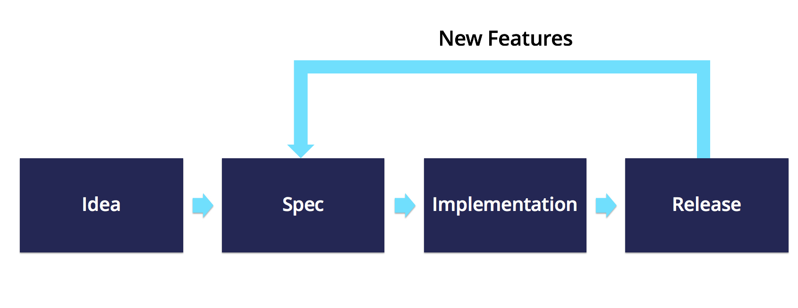

# The Good Technology Standard (GTS:2019-DRAFT-1) - Part 3: Implementation

*Every organization should adapt the following processes to their specific environment, size and structure. Simply adopting the checklist is 
insufficient.*

#### General: 
* An organization should employ the GTC standard  organization-wide and on all management levels 
* The checklist/assessment process should carry similar importance to OKRs (Objectives and Key Results Framework) 
* Every organization should openly publish a document detailing the general values and ethical standards to which they wish to adhere. 
During assessments, this document should be used as a reference as to what is considered “good” at that specific organization in that  
organization’s culture. 
* Compliance with the process should be assessed regularly, at predetermined intervals. 

#### Checklist for the implemenation of the process: 
*Four project phases are assumed: Idea, Spec, Implementation/Design, and Release/Production*

##### Idea
* The “idea” is the start of the project when new, major features are added. 
##### Spec
* In the "specification" phase, the product is mapped out in detail. The results are specs that describe the complete product functionality
##### Implementation/Design
* In the "implementation" phase, the specs that were previously written are turned into reality, meaning that  the project team works on 
turning the specs into a product
##### Release/Production
* Once design is completed, the product should be ready for the "release" phase
* Inevitably, some issues come up that require alterations to the original specs. If that occurs, the specs are adapted accordingly and, 
once the new specs are completed, the team moves into the implementation phase again
* This process repeats over and over. Even if a stable release of the product is in use, changes that require an alteration to the specs can 
occur. These require an alteration of the specs and an implementation by the team.

* The checklist has to be revisited from spec to production again (due to changes that features cause
* It is the responsibility of the project team to fill out the checklist for a project, and it should not proceed to the next phase without 
first passing the checklist assessment 
* [We recommend] For new projects, the Idea and Production phases require the approval of management at least two levels above the project 
team 
* [We recommend] All other phases require approval from management one level above the project team (also when adding new features) 
* Approval can be non-formal, but must always be documented in the checklist document 

#### Escalation: 
* [We recommend] In case the checklist assessment fails on one or more questions, it has to be escalated one level higher than the person 
who would typically approve it. If it is not possible to resolve the issue (for example, because the removal of the product feature causing 
the issue would make the product impossible to implement), it should be considered critical and escalated to upper management (e.g., the 
CTO)
* Similarly, if an escalation was officially resolved, but an employee feels as though it contradicts guidelines/organization  values, they 
should be able to escalate it directly to upper management without having to fear repercussions 
* [We recommend] Allowing employees to be able to report such issues while remaining anonymous if they so desire 

#### Hiring/Internal Communication: 
* Every employee is informed about the process during onboarding 
* The importance of escalating issues (to the highest level, if necessary) is communicated and reinforced 

#### External Communication/Marketing: 
* [We recommend] To communicate clearly to all stakeholders that the organization follows the guidelines, which have myriad positive 
effects:
* Future employees who value the guidelines can be targeted during recruiting 
* A foundation of strong values attracts potential consumers
* A broad knowledge across all stakeholders that the organization follows the guidelines makes it easier for it to execute them 

#### Marketing/Advertising 
* Marketing should be in line with the GTS and adhere to the rules laid out in User Product Education and Transparency. They should consult 
the project team to understand in-depth the technology when starting a new campaign 
* Employees should be able to escalate the issue if they feel that product marketing is not in line with the guidelines (Again: It is a 
two-step process, first escalate to superior, if no success/resolution to upper management).
* [We recommend] To implement processes and steps that enforce and oversee compliance with the GTS, but presently do not have 
recommendations, as marketing is setup very differently in different companies, and often various agencies are engaged on a per-campaign 
basis 

#### Legal 
* The Legal Department should be briefed about the value framework, GTS and its implications 
* [We recommend] That escalation should be possible if an employee or project team feels that a feature that was made “technically legal” 
through extensive Terms of Use changes, but does not align with the  organization’s values
